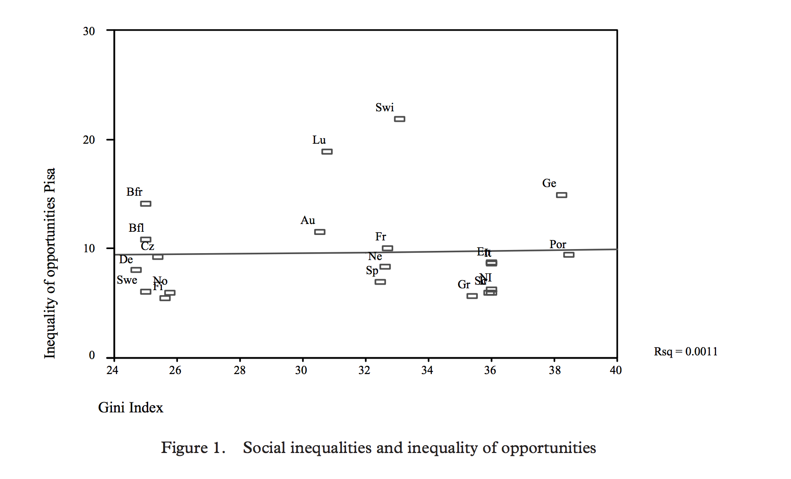
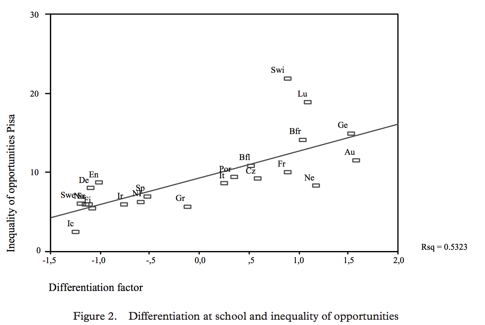
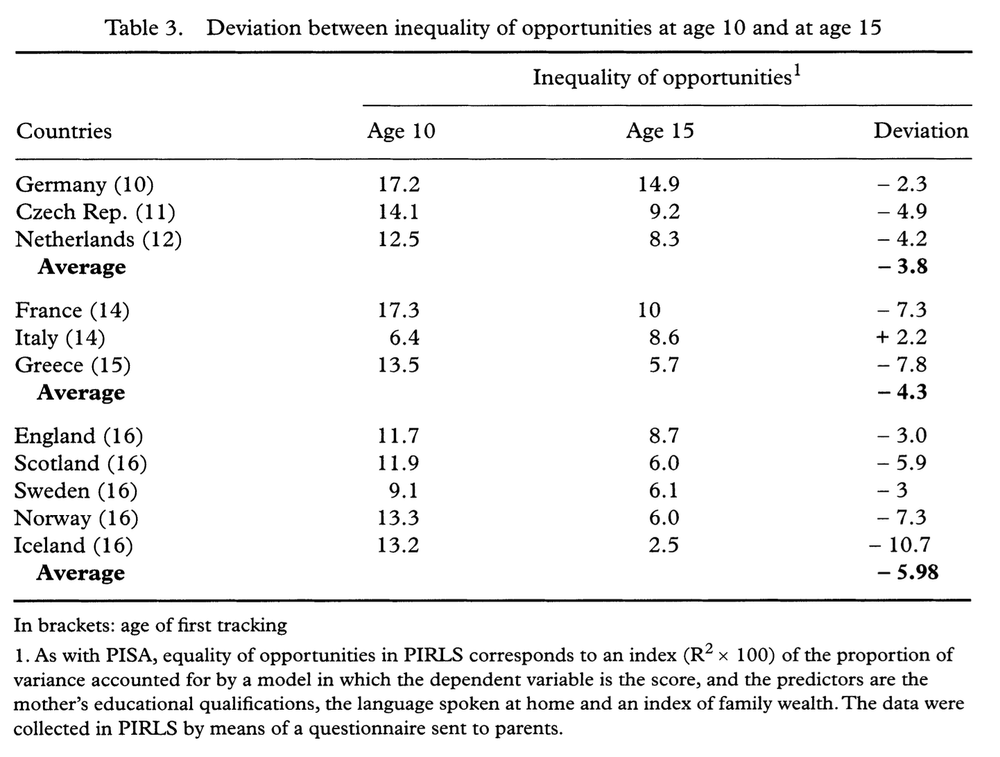

```{r, echo = F}
knitr::opts_chunk$set(
  echo = F,
  warning = F,
  message = F,
  fig.align = 'center'
)
```

```{r, open_packages}
library("PISA2000lite")
library("PISA2003lite")
library("PISA2006lite")
library("PISA2009lite")
library("PISA2012lite")
library(tidyverse)
library(countrycode)
library(cimentadaj)
library(haven)
library(intsvy)
library(ggrepel)
library(SAScii)
library(foreign)
source("http://peterhaschke.com/Code/multiplot.R")
```

```{r, read_data}
# student2015 <- read_sav("/Users/cimentadaj/Downloads/PISA/PISA2015/CY6_MS_CMB_STU_QQQ.sav")

# pisa2012_dir <- "/Users/cimentadaj/Downloads/PISA/PISA2012/"
# dic_student <- parse.SAScii(sas_ri = paste0(pisa2012_dir, 'PISA2012_SAS_student.sas'))
# student2012 <- read_fwf(file = paste0(pisa2012_dir, 'INT_STU12_DEC03.txt'),
#                         col_positions = fwf_widths(dic_student$width), progress = T)
# colnames(student2012) <- dic_student$varname
```

```{r, opening_data}
# pisa_data_names <- c("math2000", paste0("student", seq(2003, 2015, 3)))
# 
# pisa <-
#   map(pisa_data_names, ~ as_tibble(get(.x))) %>%
#   setNames(pisa_data_names) %>%
#   enframe()
```

```{r}
# pisa$selected_vars <-
#   map(seq_along(pisa$value), function(row) {
#   immigrant_var <-
#     switch(pisa$name[row],
#          "math2000" = "ST16Q01",
#          "student2003" = "ST15Q02",
#          "student2006" = "ST11Q02",
#          "student2009" = "ST17Q02",
#          "student2012" = "ST20Q02",
#          "student2015" = "ST019BQ01T")
#   # Changing  immigrants variable name to be the same across all surveys
#   
#   if ("hisei" %in% names(pisa$value[[row]])) pisa$value[[row]]$HISEI <- pisa$value[[row]]$hisei
#   # Changing HISEI to uppercase
#   
#   pisa$value[[row]] %>%
#     rename_(mom_imm = immigrant_var)
# })
# 
# # create variables and select the variables to use.
# pisa$selected_vars <-
#   pisa$selected_vars %>%
#   map(function(data) {
#     data %>%
#       mutate(country = pisa_countrynames[as.character(CNT)],
#              MISCED = car::recode(MISCED, "1:5 = 0; 6:7 = '1'")) %>%
#       select(country, MISCED, mom_imm, HISEI, ends_with("READ"), ends_with("MATH"))
# })
```

<!-- NOTE: The dataset for this document is HUGE. You should uncomment most of the codechunks above and the code chunk below. In codechunk `read_data` you will have to download PISA 2015 and PISA 2012 and change directories for the .sav files. -->

```{r, modeling}
# pisa$reg_models_math <- map(seq_along(pisa$selected_vars), function(index) {
#   print(pisa$name[index])
#   
#   if (pisa$name[index] == "student2015") {
#   pisa2015.reg.pv(x = c("MISCED", "mom_imm", "HISEI"),
#                   pvlabel = "MATH", by = "country", data = pisa$selected_vars[[index]])
#   } else {
#   pisa.reg.pv(x = c("MISCED", "mom_imm", "HISEI"),
#               pvlabel = "MATH", by = "country", data = pisa$selected_vars[[index]])
#   }
# })
# pisa$reg_models_read <- map(seq_along(pisa$selected_vars), function(index) {
#   print(pisa$name[index])
#   if (pisa$name[index] == "student2015") {
#   pisa2015.reg.pv(x = c("MISCED", "mom_imm", "HISEI"),
#                   pvlabel = "READ", by = "country", data = pisa$selected_vars[[index]])
#   } else {
#   pisa.reg.pv(x = c("MISCED", "mom_imm", "HISEI"),
#               pvlabel = "READ", by = "country", data = pisa$selected_vars[[index]])
#   }
# })

# The previous data frame is HUGE. In case you want to save it for
# opening it in the future, use:

# write_rds(pisa, path = "./pisa")
pisa <- read_rds("./pisa")
colnames(pisa)[4] <- "reg_models_math"
```

In 2006, Vincent Dupriez and Xavier Dumay published a paper called 'Inequalities in school systems: effect of
school structure or of society structure?' which you can download from [here](http://www.tandfonline.com/doi/full/10.1080/03050060600628074?scroll=top&needAccess=true) in 'Comparative Education' where they attempted  to measure the degree of educational inequality in a country and whether it was related to school structure rather than societal inequality. The argument they propose does follow a logical explanation, and theoretically, has valid conclusions. In this brief paper, it is my attempt to replicate some of their findings, and where possible, extend it.

As a first analysis, @dupriez2006 posit a question: is the effect of family background related to the degree of tracking in a country or is it related to the degree of economic inequality? This questions comes arund because tracking has been often found to be correlated and often causally [@hanushek2006] related to dispersion of test scores. @dupriez2006 hypothesize that background effects are primarily related to the school structure and not that level of inequality of the society. In fact, they suggest that, if society is behind the change of the background effects then we should expect to find a fairly strong relationship. Probably because there aren't a lot of European countries to concentrate on, they only look at this relationship within Europe, a region with little variation in terms of economic equality. The authors warn that this might be one reason why their results are not entirely valid and should be careful in making general remarks.

They find that the Gini index^[Taken from the World Development Report, United Nations, 2003] is unrelated to family background. What do they use as family background? Well, building on the definition of @shavit1993 and @breen1992, they adopt the definition that equality is a country where a child's performance is statistically independente of the background where they come from. It is for this reason that their index is a simply the R-square of regression of child performance on mother's education (coded as 1 for post-secondary education and 0 for less), whether the same language is spoken at home/school and the International Socio-Economic Index.

## Economic inequality

They're first results are below and show that the two variables are independente of each other.



The Y axis is the percent of explained variance of the model explained above whereas the X axis is the GINI coefficient. In this paper I try to replicate to the closest possible their model specification. I run a model with child's performance as the dependent variable, mother's education coded as 1 for ISCED 5B or higher (which is the beginning of tertiary education, see [here](https://en.wikipedia.org/wiki/International_Standard_Classification_of_Education) for a formal definition of each category), whether the mother is an immigrant or not and the ISEI index. As one cas see, the model specification is slightly different due to the mother's variable. I choose this model specification because it was not very easy to code this variable in new PISA surveys (I couldn't find it). However, I presume that both the language variable and whether the mother was an immigrant are capturing similar things and the results should be fairly similar. Below I plotted the same relationship for all European countries.

```{r, obtain_rsq}

r_square_extractor <- function(model) {
  map(model, ~ map(.x, ~ .x$reg[grep("squared", row.names(.x$reg)), 1:2])) %>%
  map(~ enframe(.x) %>% unnest(value))
}

pisa$r_sq_math <- r_square_extractor(pisa$reg_models_math)
pisa$r_sq_read <- r_square_extractor(pisa$reg_models_read)

pisa_unnested <-
  pisa %>%
  unnest(r_sq_math, r_sq_read)
```

```{r, data_ready}
vars <- c("estimate", "std.error")
colnames(pisa_unnested) <-
  c("type", "country",paste0(vars, "_math"), paste0(c("country", vars), "_read"))

pisa_to_nest <-
  pisa_unnested %>%
  mutate(type = ifelse(type == "math2000", "student2000", type),
         region = countrycode::countrycode(country, "country.name", "region"),
         continent = countrycode::countrycode(country, "country.name", "continent")) %>%
  separate(type, c("resp", "year"), sep = 7)

# Data set is ready!
```

```{r, gini_data}
gini <-
  read_csv("./tabula-hdr.csv", skip = 5) %>%
  rename(countries = `High human development`,
         mix_vars = X6) %>%
  select(countries, mix_vars) %>%
  separate(mix_vars, c("random", "avg_gini"), sep = " ") %>%
  separate(countries, c("ID", "Country")) %>%
  select(-random, - ID) %>%
  mutate(avg_gini = as.numeric(car::recode(avg_gini, '".." = NA')),
         Year = "2000") %>%
  filter(complete.cases(.))
```

```{r, europe_scatterplots, fig.width = 10}
pisa_to_nest_2 <-
  gini %>%
  right_join(pisa_to_nest, by = c("Country" = "country", "Year" = "year"))

rounder <- function(number) round(number, digits = 2)

theme_jorge <- function() {
  theme_minimal() +
    theme(axis.line = element_line(colour = "grey"),
          panel.grid.major.x = element_blank(),
          panel.grid.minor.x = element_blank(),
          panel.grid.major.y = element_blank(),
          panel.grid.minor.y = element_blank())
}

p1 <-
  pisa_to_nest_2 %>%
  filter(continent == "Europe" & Year == "2000") %>%
  ggplot(aes(avg_gini, estimate_math)) +
  geom_smooth(method = "lm", se  = F) +
  geom_point(alpha = 0.7) +
  geom_text_repel(aes(avg_gini, estimate_math, label = Country)) + # In case want to see which country is which
  ylim(0, 0.30) +
  scale_colour_discrete(guide = F) +
  scale_x_continuous(labels = seq(24, 40, 2),
                     breaks = seq(24, 40, 2)) +
  ggtitle("Mathematics") +
  xlab("Gini Index") +
  ylab("Inequality of opportunities") +
  theme_jorge()

p2 <-
  pisa_to_nest_2 %>%
  filter(continent == "Europe" & Year == "2000") %>%
  ggplot(aes(avg_gini, estimate_read)) +
  geom_smooth(method = "lm", se  = F) +
  geom_point(alpha = 0.7) +
  geom_text_repel(aes(avg_gini, estimate_read, label = Country)) + # In case want to see which country is which
  scale_y_continuous(name = NULL, limits = c(0, 0.30)) +
  scale_colour_discrete(name = "") +
  scale_x_continuous(labels = seq(24, 40, 2),
                     breaks = seq(24, 40, 2)) +
  ggtitle("Literacy") +
  xlab("Gini Index") +
  ylab("Inequality of opportunities") +
  theme_jorge()

multiplot(p1, p2, cols = 2)
```

```{r, eval = F}
temp_dir <- tempdir()

file_unzip <- file.path(temp_dir, "stata.zip")
download.file("https://www.wider.unu.edu/sites/default/files/WIID3.4_New.zip", file_unzip)
unzip(file_unzip, exdir = temp_dir)
file_name <- list.files(temp_dir, pattern = "WII.*\\.dta")

gini_various <-
  read_dta(file.path(temp_dir, file_name)) %>%
  select(Country, Year, Gini, P5, P95) %>%
  mutate(Year = as.character(Year))

unlink(temp_dir, recursive = T)
```

@dupriez2006 plotted the relationship only for literacy, in which I get a slightly positive slope rather than their flat relationship. In fact, the actual correlation is `r rounder(with(subset(pisa_to_nest_2, Year == "2000" & continent == "Europe"), cor(avg_gini, estimate_math, use = "complete.obs")))` for Mathematics and `r rounder(with(subset(pisa_to_nest_2, Year == "2000" & continent == "Europe"), cor(avg_gini, estimate_read, use = "complete.obs")))` for Literacy. Both relationships are insignificant, proving that they adhere to Dupriez and Dumay's hypothesis. This replication shows that the relationship was indeed estimated correctly, and is robust even to a slightly different model specification. One additional contribution from this replication is to extend this same analysis to all other PISA surveys and include several other economic inequality indicators. By the time @dupriez2006 carried out their analysis, only PISA 2000 and 2003 were available. Up next I replicate the same analysis for all available PISA surveys to check for changes over time.

Using [OECD data](https://stats.oecd.org/Index.aspx?DataSetCode=IDD), I searched for all available years for each country. Remember that the PISA waves we have range from the year 2000 to the year 2015, every three years. Because not all indicators have data for all PISA years, I always choose the closest year available. So for example, if we had data on the year 2001 but no on the year 2000, I imputed the year 2000 with the 2001 value. This gives us a nice time-series analysis, not only on the Gini index, but on all other economic inequaltiy indicators. Below you can find the plots.

```{r, ineq_indicators}
## Download the data from https://stats.oecd.org/Index.aspx?DataSetCode=IDD.
## click on Export -> Text File (CSV) - > Download
##### All income inequality indicators
all_ineq_indicators <-
  read_csv("./IDD_10042017150802214.csv") # Update this name with the new name because it changes

# setNames(unique(all_ineq_indicators$Measure), unique(all_ineq_indicators$MEASURE))
# The above code gives you all the measured available with its code.
indicators <- c("GINI", "GINIB", "GINIG", "PALMA", paste0("P90P", c("10", "50")),
                        "P50P10", "S80S20", "S90S10")
income_inequality <-
  all_ineq_indicators %>%
  select(Country, Year, AGE, Value, MEASURE, Measure, Unit, METHODO) %>%
  mutate_if(is_integer, as.character) %>%
  filter(MEASURE %in% indicators)
```

```{r, fill_all_indicators}
vector_to_fill <- seq(2000, 2015, 3)
vector_filler <- function(vector_to_fill, vector_to_fill_from) {
  
  # If the vector to search for is empty, return NA repeated n times.
  if (is_empty(vector_to_fill_from)) {
    empty_years <- rep(NA, length(vector_to_fill)) %>%
      setNames(vector_to_fill)
    
    return(empty_years)
  }
  
  # Function returns a list with information on which years to use to fill from
  which_inside_which <- function(vector_to_fill, vector_to_fill_from) {
    
    names_to_fill_from <- names(vector_to_fill_from)
    
    # Years which are present in both vectors (those we will keep as is)
    already_filled <- vector_to_fill %in% names_to_fill_from
    
    already_filled_from <- names_to_fill_from %in% vector_to_fill
    
    # Values we need to actually fill
    yrs_to_subtract <- vector_to_fill[!already_filled]
    
    # Values available to fill the yrs_to_subtract vector
    yrs_to_loop <- as.numeric(names(vector_to_fill_from))
    
    list(years_filled = already_filled,
         years_filled_from = already_filled_from,
         years_to_subtract = yrs_to_subtract,
         years_to_loop = yrs_to_loop)
  }
  
  indexes <- which_inside_which(vector_to_fill, vector_to_fill_from)
  
  indices_to_match <-
    map(indexes$years_to_subtract, function(.x) {
      subtraction <- .x - indexes$years_to_loop # subtract each year to be filled from all available years
      abs_subtr <- abs(subtraction)
      abs_subtr == min(abs_subtr) # Check which year is the closest to the year to be filled in
    })
  
# Subset the closest year and calculate the mean in case there is more than one value
  new_values <-
    map_dbl(indices_to_match, ~ mean(vector_to_fill_from[.x])) %>% 
    setNames(indexes$years_to_subtract) %>%
    `c`(vector_to_fill_from[indexes$years_filled_from])
  
  correct_order <-
    names(new_values) %>%
    as.numeric() %>%
    order()
  
  new_values[correct_order]
}

country_names <- unique(income_inequality$Country)
inequality_indicator <- unique(income_inequality$MEASURE)[-3]
# Excluding GINIG which is not found in the data

# Loop through each country, and then through each inequality indicator and apply the function from above.
# This will return a list for each country containing all inequality indicators.
all_indicators <-
  map(country_names, function(country_name) {
    map(inequality_indicator, function(inequality_indicator) {
      
      specific_country <- with(income_inequality,
                               income_inequality[MEASURE == inequality_indicator &
                                                   Country == country_name &
                                                   METHODO == "METH2011" &
                                                   AGE == "TOT", c("Country", "Year", "Value")])
      
      vector_to_fill_from <- with(specific_country, setNames(Value, Year))
      
      vector_filler(vector_to_fill, vector_to_fill_from)
      
    })
  }) %>%
  setNames(country_names)
```

```{r, scatterplots_for_all_indicators, fig.width = 10, fig.height = 9}
# Take that list, for each country, cbind it and the data frame it.
# Finally, row bind all of those data frames.
reduce_df <-
  all_indicators %>%
  map(~ reduce(.x, function(x, y) as.data.frame(cbind(x, y)))) %>%
  reduce(rbind)

colnames(reduce_df) <- inequality_indicator

# Create the year and country variables plus make the data long rather than wide
# Join that data frame with the Rsquare data from before, by country and year

pisa_to_nest_2 <-
  reduce_df %>%
  as_tibble() %>%
  mutate(year = as.character(rep(vector_to_fill, length(country_names))),
         country = rep(country_names, each = length(vector_to_fill))) %>%
  gather(indicators, value, GINI:S90S10) %>%
  right_join(pisa_to_nest, by = c("country", "year")) %>%
  filter(country != "Russia")


my_plots <-
  map(na.omit(unique(pisa_to_nest_2$indicators)), function(inequality_measure) {
  pisa_to_nest_2 %>%
  filter(continent == "Europe" & indicators == inequality_measure) %>%
  ggplot(aes(value, estimate_read)) +
  geom_point(alpha = 0.7) +
  # geom_text_repel(aes(Value, estimate_math, label = country)) + # In case want to see country names
  geom_smooth(method = "lm") +
  xlab(inequality_measure) +
  ylab("") +
  facet_grid(~ year) +
  theme_jorge()
})

multiplot(my_plots[[1]], my_plots[[2]],
          my_plots[[3]], my_plots[[4]], cols = 1)
```

Each row represents an economic inequality indicator. Below you can find a small description of each one.

```{r}
table <- 
  enframe(setNames(unique(all_ineq_indicators$Measure), unique(all_ineq_indicators$MEASURE))) %>%
    filter(name %in% indicators)

knitr::kable(table)
```

As we can see, the relationship is flat, not only for the Gini index but for all other indicators, across all years. Below is another set of indicators, which resembles the above graph as well^[I excluded Russia from all of these scatterplots because it was a strong outlier].

```{r, fig.width = 10, fig.height = 9}
multiplot(my_plots[[5]], my_plots[[6]],
          my_plots[[7]], my_plots[[8]], cols = 1)
```

Up next I plot the correlations for all years and all indicators.

```{r, correlations_for_all_indicators}
cor.extract <- function(cor_object) {
  data.frame(cor = unname(cor_object$estimate), p_val = cor_object$p.value)
}

correlation_tests_second <-
  pisa_to_nest_2 %>%
  filter(continent %in% c("Europe") & country != "Russia") %>%
  split(interaction(.$year, .$continent, .$indicators)) %>%
  na.omit() %>%
  map(~ cor.test(.x$estimate_math, .x$value))

my_corrs <-
  map(inequality_indicator, function(ineq_indi) {
  map(correlation_tests_second, cor.extract) %>%
  enframe() %>%
  unnest(value) %>%
  separate(name, c("year", "country", "indicators")) %>%
  filter(indicators == ineq_indi)
})

my_corrs %>%
  reduce(rbind) %>%
  ggplot(aes(year, cor)) +
  geom_hline(yintercept = 0) +
  geom_line(aes(group = indicators, colour = indicators)) +
  geom_point(aes(colour = indicators), size = 2) +
  scale_colour_discrete(name = NULL) +
  xlab("") + ylab("Correlation") +
  theme_jorge()
```

The correlations are predominantly negative, which should be the other way around, however they are insignificant. There seems to be a wiggly pattern that the correlations go up and down, but no discernible pattern emerges. It does look like this relation doesn't exists very strongly.

## Tracking

As a second step, they hypothesize that the relationship should be much stronger using a summary of the level of differentiation of a country's educational system. That is, countries which have highly tracked educational systems, should have high levels of family background effects. They find that that relationship is strong with a correlation of about 0.50.



They measure differentiation by using an index developed by @duru2004. This index is a factor score constructed on the basis of three variables: the age at which different tracks,
or separate educational pathways, are first introduced in each school system; the percentage of pupils who have fallen behind their age group at age 15; and an index of academic segregation between schools at age 15. This index indeed shows to be strongly correlated with family background effects.

Because the degree of tracking and differentiation of a country hardly changes over time, unless a top-to-bottom reform is implemented [@poland2010], I trust that using the same indicator over time can be a rough approximation of what happens in reality. In my replication, I will use a slightly different tracking indicator. Following @thijs2013, I will use their set of indicators. Acknowledging that most authors use different representations of tracking, @thijs2013 created a widely comprehensive set of indicators for tracking and vocational enrollment that portray very nicely the level of fragmentation of an educational system. The data can be accesed [here](http://thijsbol.com/data/).

Up next I plot the new tracking indicator and the importance of family background.

```{r, tracking_plots, fig.width = 10}
##### Tracking indicator

temp_dir <- tempdir()
file.remove(file.path(temp_dir, list.files(temp_dir))) %>%
  invisible()

file_name <- file.path(temp_dir, "tracking.zip")
download.file("http://thijsbol.com/wp-content/uploads/2015/09/educsysdata-v4.zip",
              destfile = file_name)

unzip(file_name, exdir = temp_dir)

tracking_name <- list.files(temp_dir, pattern = "bw-.*\\-full-.*\\.dta")

tracking <-
  read_dta(file.path(temp_dir, tracking_name)) %>%
  select(-bwid, -cntry)

pisa_to_nest_3 <-
  pisa_to_nest %>%
  left_join(tracking, c("country" = "cntry_name"))

p3 <-
  pisa_to_nest_3 %>%
  filter(continent == "Europe") %>%
  ggplot(aes(ztrack, estimate_math, alpha = std.error_math)) +
  geom_point() +
  geom_smooth(method = "lm") +
  scale_x_continuous(name = NULL) +
  scale_y_continuous("Inequality of opportunity") +
  ggtitle("Mathematics") +
  facet_wrap(~ year, ncol = 6) +
  scale_alpha_continuous(guide = F) +
  theme_jorge()

p4 <-
  pisa_to_nest_3 %>%
  filter(continent == "Europe") %>%
  ggplot(aes(ztrack, estimate_read, alpha = std.error_math)) +
  geom_point() +
  geom_smooth(method = "lm") +
  ggtitle("Reading") +
  scale_x_continuous(name = "Tracking Index") +
  scale_y_continuous("Inequality of opportunity") +
  facet_wrap(~ year, ncol = 6) +
  scale_alpha_continuous(guide = F) +
  theme_jorge()

multiplot(p3, p4, cols = 1)
```

Just like in @dupriez2006 I find a strong correlation between the two. In fact, both correlations verge on the 0.5, just in the their original paper. Overtime the correlation is becoming weaker, but it is still very substantial. Up next I plotted the evolution of this correlation for Mathematics.

```{r}
correlation_tests_third <-
  pisa_to_nest_3 %>%
  filter(continent %in% c("Europe")) %>%
  split(interaction(.$year, .$continent)) %>%
  na.omit() %>%
  map(~ cor.test(.x$estimate_math, .x$ztrack))

corr_df <-
  map(correlation_tests_third, cor.extract) %>%
  enframe() %>%
  unnest(value) %>%
  separate(name, c("year", "country"))

corr_df %>%
  ggplot(aes(year, cor)) +
  geom_line(aes(group = country)) +
  geom_smooth(aes(group = country), method = "lm") +
  geom_point() +
  ggtitle("Mathematics") +
  ylab("Tracking * Inequality of opportunity correlation") +
  xlab("") +
  theme_minimal() +
  coord_fixed(3)
```

One can see a downward trend, going down from a high 0.7 in 2003 to the actual 0.5 correlation coefficient. All results at this point suggest the results of @dupriez2006 not only were correct, but that they hold over time and across a wide variety of indicators.

## Before tracking

@dupriez2006 acknowledge that if their hypothesis is true, then early tracking countries should have greater difficulty at reducing inequalities relative to late-tracking countries. For that analysis they created a table that portrays their inequality indicator estimated from PIRLS and PISA data. They then subtract each one and check which countries had bigger reductions, relative to their degree of tracking.

I replicated their analysis for all available PIRLS years (2001, 2006 and 2011) and compared them to their closest PISA equivalents (2000, 2006 and 2012). However, I had to do some compromises because not all variables were present in all data sets. For example, instead of the PISA socio-economic index, I had to use an index of home possesions for 2001, an index of home educational resources for 2006 and parent's highest occupational status in 2011. I do acknowledge that this turns the analysis upside down but I wasn't able to find neither a similar PISA index in PIRLS nor a consistent index available in all waves. All the analysis carried out for the PIRLS are for literacy, just as @dupriez2006.



I tried to reproduce the above a bit differently below.

```{r}
# These are all the directories where I keep the PIRLS data for all years (only 4th grade)
pirls_dir <- "/Users/cimentadaj/Downloads/PIRLS/"
years <- c("2001", "2006", "2011")
pirls_dir2 <- paste0(pirls_dir, years, "/PIRLS/Grade 04/", "Y", years, "/Data/SPSS/")

# Open the codebook and read it (remember t change all files to .dbf)
# try <- map(file.path("/Users/cimentadaj/Downloads/pirls_2001_codebooks_upd", list.files("/Users/cimentadaj/Downloads/pirls_2001_codebooks_upd", pattern = ".dbf")), read.dbf)
 
# This code allows me to find variables using regular expressions
# map(try, ~ .x[grep("MOTHER", .x$FIELD_LABL), c("FIELD_NAME", "FIELD_LABL")])

# Question values for each year for mother's education, mother's immigration status
# and socio-economic status. I had to compromise some of the variables due to
# not being available for all years. Next to each variable is a comment describing it.

eduparent <- c("2001" = c("ASBHEDUM"),
                       "2006" = c("ASBHLEDM"),
                       "2011" = c("ASBH17B"))

mothers_immigrant <- c("2001" = "ASBGBRNM",
                          "2006" = "ASBGBRNM",
                          "2011"= "ASBH16B") # language spoken by mother

socio_economic_index <- c("2001" = "ASDGPS", # INDEX OF HOME POSESS
                             "2006" = "ASDHHER", # INDEX of HOME-Educational resources
                             "2011" = "ASDHOCCP") # Parent's highest occupational status 

# List containing directories, and variables for all years
pirls_list <- list(pirls_dir2, eduparent, mothers_immigrant, socio_economic_index)

# Loop through the previous list, and in parallel, merge each year with their corresponding
# variables.
pirls <- 
  pmap(pirls_list, function(one, two, three, four) {
    if (one == pirls_dir2[3]) {
    pirls.select.merge(one, home = c(two, three, four))  
    } else {
    pirls.select.merge(one, home = two, student = c(three, four))
    }
  })

# Recode to make mother's education 1 for post-secondary and 0 below.
parent_coding <- c("1:6 = 0; 7:8 = 1; else = NA",
                   "1:4 = 0; 5:7 = 1; else = NA",
                   "1:5 = 0; 6:8 = 1; else = NA")

# List containing datasets, coding for each year (education) and variable names to rename.
rename_list <- list(pirls, eduparent, mothers_immigrant, socio_economic_index, parent_coding)

# Rename all variables for each dataset and recode education for each datasets
pirls_two <- pmap(rename_list, function(data, education, mom_imm, socio, parent_coding) {
  data %>%
      rename_(mother_edu = education,
              mothers_imm = mom_imm,
              socio_econ_ind = socio) %>%
      mutate(mother_edu = car::recode(as.numeric(mother_edu), parent_coding),
             mothers_imm = as.numeric(mothers_imm))
})

# Estimate literacy models, for all newly renamed variables, for each year
pirls_read <- map(pirls_two, ~
  pirls.reg.pv(x = c("mother_edu", "mothers_imm", "socio_econ_ind"),
               by = "IDCNTRYL",
               data = .x))
# Extract rsquared of each country, of each year, then create a column in each
# data containing the wave year, and rbind them all together.
pirls_sq_read <-
  r_square_extractor(pirls_read) %>%
  map2(c("2001", "2006", "2011"), function(data, year) data %>% mutate(year = year)) %>%
  reduce(rbind) %>%
  rename(pirls_read_estimate = Estimate,
         std.error_pirls_read = `Std. Error`,
         country_pirls = name)

# Take the PISA estimations (math and read) and only choose the years which are comparable to the
# PIRLS waves. Just so we can merge them together, change the years to PIRLS years, like
# PISA 2000 will now be 2001, and the same for 2012.

pisa_to_pirls <-
  pisa_to_nest %>%
  filter(year %in% c("2000", "2006", "2012")) %>%
  mutate(year_pirls = as.character(car::recode(year, "2000 = 2001; 2012 = 2011")))

# Merge both PISA and PIRLS, calculate the difference, add the tracking data and create
# labels and graph them.
age_tracking <-
  tracking %>%
  select(cntry_name, selage)

pisa_to_pirls %>%
  left_join(pirls_sq_read, by = c("country" = "country_pirls", "year_pirls" = "year")) %>%
  mutate(continent = countrycode(country, "country.name", "continent")) %>%
  filter(!is.na(pirls_read_estimate) & continent == "Europe") %>%
  select(continent, country, year_pirls, contains("estimate"), contains("pirls")) %>%
  mutate(diff_read = estimate_read - pirls_read_estimate) %>%
  left_join(age_tracking, by = c("country" = "cntry_name")) %>%
  mutate(label = paste0(country, " (", selage, ")")) %>%
  ggplot(aes(reorder(label, -selage), year_pirls, fill = diff_read < 0)) +
  geom_tile() +
  coord_flip() +
  scale_fill_manual(guide = F, values = c("lightcoral", "skyblue2")) +
  scale_y_discrete(name = NULL) +
  scale_x_discrete(name = NULL) +
  ggtitle("Which countries had a reduction of inequality of opportunity over time?") +
  theme_jorge() +
  theme(axis.line = element_blank())
```

In this plot I coloured inequality reduction as blue and increase as red. The blue means that inequality was higher in PIRLS (ages 9-10) than in PISA (age 15) whereas the red squares suggest that inequality increased (PIRLS inequality is lower than PISA inequality). From this analysis, the results of @dupriez2006 don't add up. For example, they find that Sweden, France, Netherlands and Czech Republic had reductions of inequality when I find that they had increases of inequality. Moreover, I don't find any strong distinctions between tracking ages (next to the label) and the level of inequality. Even more discouraging, is the fact that no clear patterns emerges for any country over time. It's just as likely for a country to be red/blue acros the three waves.

This paper is not yet a rigorous replication of @dupriez2006. I have not spoken to the authors to identify in detail how they coded each variable (although they specified it in their paper) nor which specific socio-economic indicator they used for the PIRLS analysis. However, I've tried to choose the most appropriate replication scheme. Although some results do replicate very nicely, some don't, and they were attempted to be as close as the original analysis. The R code to replicate this analysis is embedded in this Rmarkdown document, so anyone can replicate my analysis and improve it further.

Any comments can be addressed to `cimentadaj@gmail.com` or contributed directly to the Github repository of this replication [here](https://github.com/cimentadaj/Inequality_schools_replication)

```{r, eval = F}

pisa$gap_math <- map(seq_along(pisa$selected_vars), function(data_index) {
  
  # print(pisa$name[data_index])
  
  current_data <- pisa$selected_vars[[data_index]]
  if (pisa$name[[data_index]] == "student2015") {
    
    pisa2015.per.pv(pvlabel = "MATH",
                    by = "country",
                    per = c(10, 20, 50, 80, 90),
                    data = current_data)
  } else {
    
  pisa.per.pv(pvlabel = "MATH",
                  by = "country",
                  per = c(10, 20, 50, 80, 90),
                  data = current_data)
  }
  
})
pisa$gap_read <- map(seq_along(pisa$selected_vars), function(data_index) {
  
  # print(pisa$name[data_index])
  
  current_data <- pisa$selected_vars[[data_index]]
  if (pisa$name[[data_index]] == "student2015") {
    
    pisa2015.per.pv(pvlabel = "READ",
                    by = "country",
                    per = c(10, 20, 50, 80, 90),
                    data = current_data)
  } else {
    
  pisa.per.pv(pvlabel = "READ",
                  by = "country",
                  per = c(10, 20, 50, 80, 90),
                  data = current_data)
  }
  
})

years <- seq(2000, 2015, 3)
math <- map(seq_along(pisa$gap_math), function(index) {
    pisa$gap_math[[index]]$year <- years[index]
    pisa$gap_math[[index]]$subject <- "math"
    pisa$gap_math[[index]]
})
read <- map(seq_along(pisa$gap_read), function(index) {
    pisa$gap_read[[index]]$year <- years[index]
    pisa$gap_read[[index]]$subject <- "read"
    pisa$gap_read[[index]]
})

all <- list(math, read)

all_rbined <-
  all %>%
  map(~ reduce(.x, rbind))

all_types <- map(all_rbined, function(data) {
  data %>%
  select(-`Std. err.`) %>%
  spread(Percentiles, Score) %>%
  mutate(Q90_Q10 = `90` - `10`,
         Q80_Q20 = `80` - `20`,
         Q50_Q10 = `50` - `10`,
         Q90_Q50 = `90` - `50`,
         country = as.character(country),
         year = as.character(year)) %>%
  select(-(`10`:`90`)) %>%
  gather(type, value, -country, -year, -subject)
})

all_types_2 <-
  all_types %>%
  reduce(rbind)

pisa_to_nest_4 <-
  pisa_to_nest %>%
  left_join(all_types_2, by = c("country", "year"))

pisa_to_nest_4 %>%
  filter(subject == "math" & type == "Q80_Q20" & continent == "Europe") %>%
  ggplot(aes(value, estimate_math)) +
  geom_point() +
  geom_smooth(method = "lm") +
  facet_wrap(~ year)

```

## Bibliography